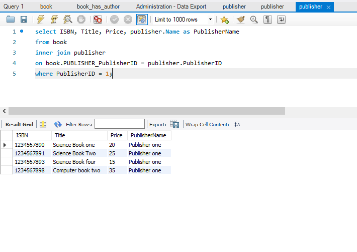

#  query (a)
ISBN number, book title and price of books for books whose prices are greater than $19.99
and less than $50.00.    

     

# query (b)
ISBN number, book title and price of books for books whose title include ‘Science’.     

     

# query (c)
ISBN number, book title, price and publisher name for books that a certain publisher of
your choice has published. 

     

# query (d)
ISBN number, book title, price and author name for books that a certain author of your
choice has published.

   

# query (e)
Author name and the average book price of all books that a certain author of your choice
has published.    

   

