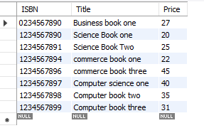

#  query (a)
ISBN number, book title and price of books for books whose prices are greater than $19.99
and less than $50.00.    

### Sql query
~~~sql
select ISBN, Title, Price from book where ( price > 19.9 and price < 50 );
~~~
### Output Result 
     

# query (b)
ISBN number, book title and price of books for books whose title include ‘Science’.     

### sql query
~~~sql
select ISBN, Title, Price from book where title like '%Science%';
~~~

### Output Result 
     

# query (c)
ISBN number, book title, price and publisher name for books that a certain publisher of
your choice has published. 

### sql query
~~~sql
select ISBN, Title, Price, publisher.Name as PublisherName 
from book 
inner join publisher
on book.PUBLISHER_PublisherID = publisher.PublisherID
where PublisherID = 1;
~~~

### Output Result 
     

# query (d)
ISBN number, book title, price and author name for books that a certain author of your
choice has published.

### sql query
~~~sql
select ISBN, Title, Price, author.Name as AuthorName 
from book_has_author
join book on book.ISBN = book_has_author.BOOK_ISBN
join author on author.Author_Number = book_has_author.AUTHOR_Author_Number
where author.Name = 'Author name one';
~~~

### Output Result 
   

# query (e)
Author name and the average book price of all books that a certain author of your choice
has published.    

### sql query
~~~sql
select author.Name as AuthorName, avg( Price ) as AverageBookPrice
from book_has_author
join book on book.ISBN = book_has_author.BOOK_ISBN
join author on author.Author_Number = book_has_author.AUTHOR_Author_Number
where author.Name = 'Author name three';
~~~

### Output Result 
   

